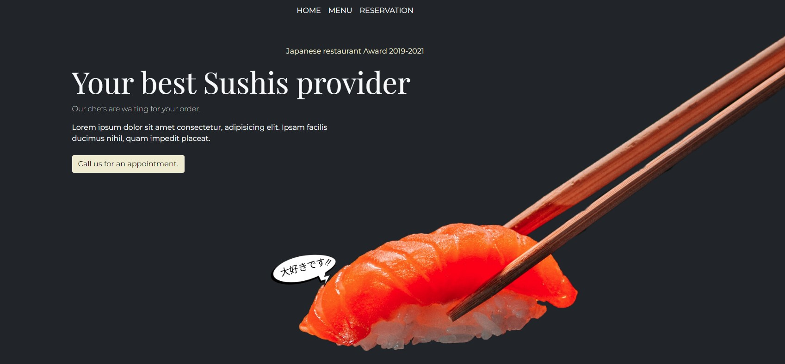

# Site Web du Restaurant Japonais - Your Best Sushis Provider (EN COURS)

## Technologies utilisées

Ce projet est un site web élégant pour un restaurant japonais de haute qualité, mettant en valeur ses sushis primés, son menu varié et son équipe de chefs experts.

## Table des matières

- [Aperçu](#aperçu)
- [Fonctionnalités](#fonctionnalités)
- [Technologies utilisées](#technologies-utilisées)
- [Prérequis](#prérequis)
- [Installation](#installation)
- [Utilisation](#utilisation)
- [Palette](#palette-de-couleurs)
- [Typographie](#typographie)

## Aperçu

Le site présente un design moderne et attrayant avec un contraste saisissant entre des fonds sombres et des images de nourriture vibrantes. Il met en avant l'expertise du restaurant en matière de sushis et sa réputation primée.

## Fonctionnalités

- Design responsive avec une navigation claire (HOME, MENU, RESERVATION)
- Présentation des plats phares 
- Section "Our Dream Team" présentant les chefs experts
- Système de réservation intégré
- Sections promotionnelles mettant en avant la qualité de la cuisine japonaise

## Prérequis

- Un serveur web local (ex : [Live Server](https://marketplace.visualstudio.com/items?itemName=ritwickdey.LiveServer) pour Visual Studio Code)
- Un navigateur web moderne (Chrome, Firefox, Safari, Edge)

## Installation

1. Clonez le dépôt sur votre machine locale : [Cliquez ici](https://github.com/pascalinecte91/Japanese-Restaurant.git)
2. Ouvrez le projet dans votre éditeur de code préféré.
3. npm init y ( y:cree le fichier package.json)
4. npm i bootstrap
5. npm i -g sass ( g: en global )

## Utilisation

1. Utilisez un serveur web local pour lancer le projet. Par exemple, avec Visual Studio Code, vous pouvez utiliser l'extension Live Server.
2. Ouvrez le fichier `index.html` dans votre navigateur pour voir la page d'accueil.
3. Naviguez à travers le site en utilisant le menu de navigation en haut de la page.

## Palette de Couleurs

| Couleur                |  | Exemple de Couleur |
|-----------------------|------------------|---------------------|
| Dark 1                |          |  |
| Beige Complémentaire  |        |  |
| Main Red              |          |  |
| Share Red 1           |          |  |
| Share Red 2           |         |  |
| Share Red 3           |         |  |

## Typographie

Ce projet utilise les deux polices suivantes :

1. **Montserrat**
   - **Styles disponibles**: 100, 200, 300, 400, 500, 600, 700, 800, 900
   - **Police**: [cliquez ici](https://fonts.google.com/specimen/Montserrat)

2. **Playfair Display**
   - **Styles disponibles**: 400, 500, 600, 700, 800, 900
   - **Police**: [cliquez ici](https://fonts.google.com/specimen/Playfair+Display)

### Exemples de texte

Voici des exemples de texte utilisant les deux polices :

### Montserrat (400):

### Playfair Display (400):
